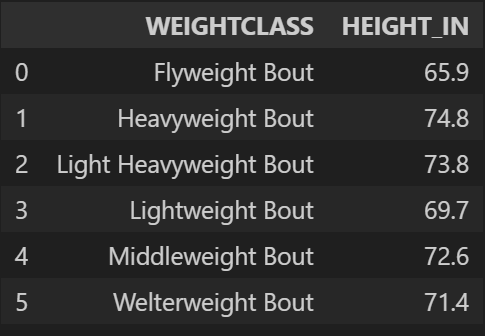
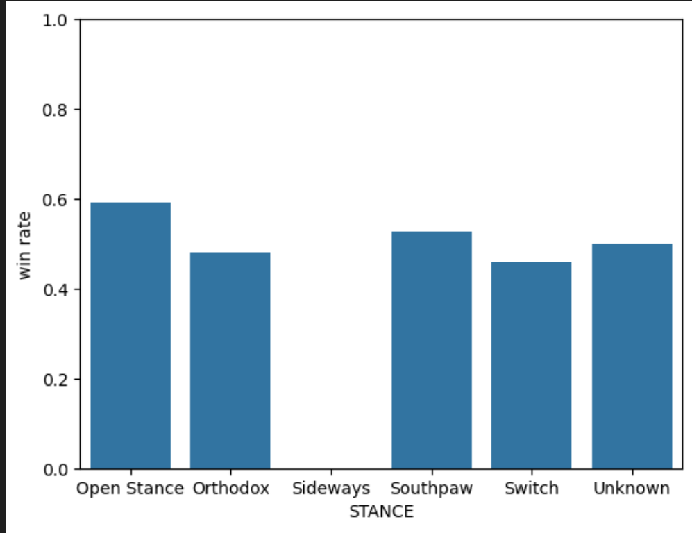

# 🥊 UFC Fight Outcome Analysis

## 📌 Overview
I’m a big UFC fan, so I decided to mix that interest with data analysis.  
I took scraped UFC stats, cleaned and merged the datasets, and explored how different fighter attributes (age, stance, reach, etc.) relate to fight outcomes.

---

## 📂 Data
- **Source:** [UFC Stats Scraper](https://github.com/Greco1899/scrape_ufc_stats)  
- **Datasets used:**  
  - `tott.csv` - fighter info (height, reach, stance, DOB, etc.)  
  - `fights.csv` - fight results (bout, outcome, winner, method, etc.)  

---

## ⚙️ Process
- Cleaned data (split bout names, converted DOB → age, standardized height/reach,etc).  
- Merged fighter stats into fight records (`F1_*` and `F2_*` columns).  
- Used **pandas** and visualizations to answer key questions.  

---

## 📊 Key Insights
- **Height/Reach:** LHW and HW fighters are unsurprisingly tallest on average, with the longest reach.  
- **Age:** Small positive correlation between age and win rate, but small effect.  
- **Finishes:** Heavier divisions (MW, LHW, HW) end more often by KO/TKO, lighter ones by unanimous decision.  
- **Stance:** No real difference in win rates between Southpaw and Orthodox.  
- **Young Fighters:** Ages 20–24 show the highest win % (though sample size is limited).  

---

## 🛠 Tools
- Python (`pandas`, `re`, `matplotlib`, `seaborn`, `datetime`)  
- Jupyter Notebook  

---

## 📈 Example Charts
  
  
